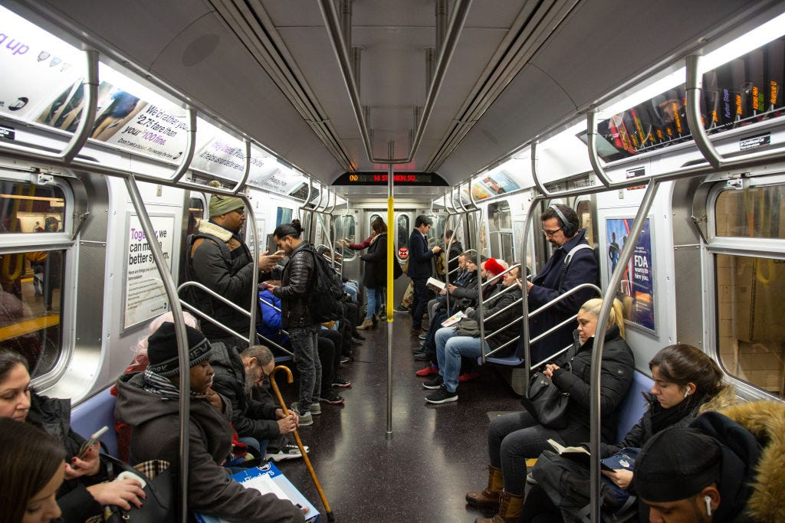

# a1-news

In this assignment, you'll edit this `README.md` file to create a Markdown document that describes a news story (full instructions on Canvas). You'll also answer questions, mostly about how to use the terminal in the `other-questions.md` file: **don't forget** to complete the instructions in that file!

# Americans see Increase in Racism and Xenophobia as Coronavirus Spreads

With the ongoing issue with the **Coronavirus** (COVID-19), many _Asian-Americans_ are being subjected to racist remarks from their community. [This article](https://www.businessinsider.com/americans-see-increase-in-racism-and-xenophobia-as-coronavirus-spreads) focuses on the experiences of _Asian-Americans_ during time of panic, taking into consideration the history of Asian immigrants and tries to see how such actions played a role in the way some Americans are acting towards _Asian Americans_ during this **Coronaviru** pandemic. One of the many victims of this situation commented her experience in riding the subway:

> Emily Park, an animation fellow at Business Insider who's Korean-American, was on the subway 
> in Manhattan on Monday when she cleared her throat. A woman stared at her for several moments 
> and then promptly got up and moved seats farther away. 

[This article](https://www.businessinsider.com/americans-see-increase-in-racism-and-xenophobia-as-coronavirus-spreads) also gives non-Asians a chance to describe the situation around them relating to _Asian-Americans_. This article also interviews non-Asians and ask them to describe what they see:

> Jennifer Hernandez, a customer success specialist at Business Insider, was getting off the PATH train from New Jersey to New York City and
> boarding an elevator when, she said, she witnessed a troubling interaction. She was on the elevator with 3 white males and one woman of Asian 
> descent, all of them apparently strangers. The 3 men started talking about the coronavirus, with one commenting about how the spread was likely
> related to "all the disgusting food Chinese people eat."

Other instances where _Asian-Americans_ are being targetted to xenphobia:

- [A man tried to kill an Asian-American family](https://www.buzzfeednews.com/article/juliareinstein/man-attempted-murder-asian-american-family)
- [Possible effects on Trump calling the Coronovirus "The Chinese Virus"](https://www.washingtonpost.com/nation/2020/03/20/coronavirus-trump-chinese-virus/)
- [A compilation of different occasions of racism towards Asian-Americans during this time](https://www.cnn.com/2020/02/20/us/coronavirus-racist-attacks-against-asian-americans/index.html)
